```{r, echo = F}
i <- 0
advance <- function(){i <<- i + 1; i}
```

Introduction: 

A little bit about blogdown and the Academic theme here...


## Step 0: **Link to Dan Quintana's  [thread](https://twitter.com/dsquintana/status/1139846569623281664){target="_blank"} for reference**

It will also be "quoted" throughout. He gives us some motivation for using blogdown and hugo-academic.  

```{r, echo = F}
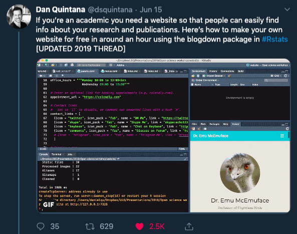
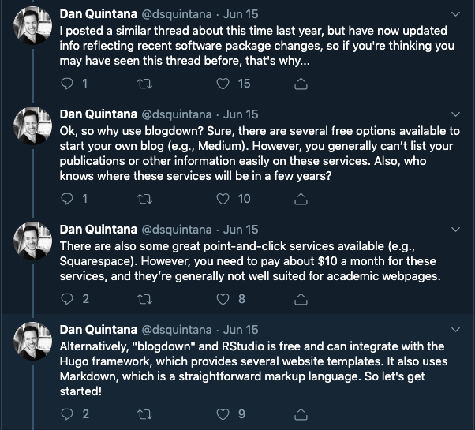
```


## Step `r advance()`: **Install blogdown** *by running install.packages("blogdown") in the console*

```{r, echo = F}

```


## Step `r advance()`: **Create file structure** *in RStudio with File -> New Project ... -> New Directory -> Website Using Blogdown -> Hugo theme: `gcushen/hugo-academic`*

This will create a *large*, overwhelming (if I may) architecture for your website of about 500 files/directories.  Let's look at only the top layer.  

```{r, echo = F}
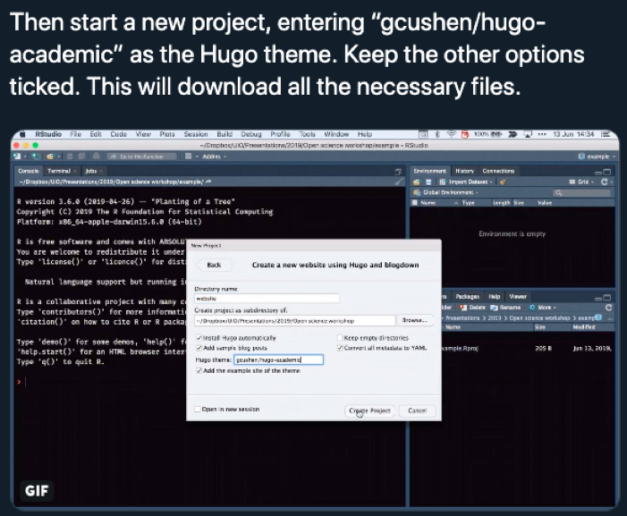
```

## Step `r advance()`: **Load blogdown** *with library(blogdown)*

I'll be using `::` syntax too,  so you'll know what functions come from what packages. 


```{r, echo = F}

```


## Step `r advance()`: **Install the "hugo" website framework** *with blogdown::install_hugo(force = TRUE)*


```{r, comment="", echo = F}
fs::dir_tree(path = "../academic_website", recurse = 0)
```

Here's Dan telling us about it.  

```{r, echo = F}
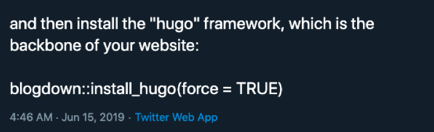
```


## Step `r advance()`: **Build the template** *blogdown::serve_site()*

### Note: I found that sometimes expected changes wouldn't appear withough first **Building the site** *with rmarkdown::render_site(encoding = 'UTF-8')* and **Building the template** use *blogdown::serve_site()*


```{r, echo = F}
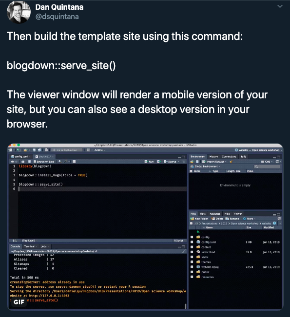
```


## Step `r advance()`: **Changing the title of your website** *in the "config.toml"*


```{r, echo = F}
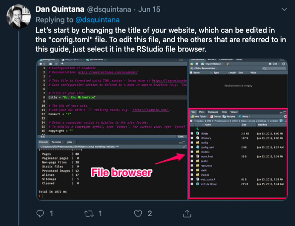
```


``` r
# Configuration of Academic
# Documentation: https://sourcethemes.com/academic/
#
# This file is formatted using TOML syntax - learn more at https://learnxinyminutes.com/docs/toml/
# Each configuration section is defined by a name in square brackets (e.g. `[outputs]`).

# Title of your site
title = "Gina Reynolds"       <- Change this part!
```


## Step `r advance()`: **Change color/theme/font of your website**  *in "config/\_default/params.toml"*

```{r, comment="", echo = F}
fs::dir_tree(path = "../academic_website/config")
```

This section:

```r
############################
## Theme
############################

# Choose a theme.
#   Latest themes (may require updating): https://sourcethemes.com/academic/themes/
#   Browse built-in themes in `themes/academic/data/themes/`
#   Browse user installed themes in `data/themes/`
theme = "minimal"
```


```{r, echo = F}
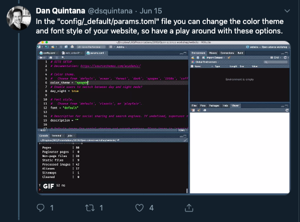
```


## Step `r advance()`: **Adjust what widgets show up** *in each of the .md files in "content/home/", e.g. in "content/home/hero.md", "active = true" to "active = false"*


Demo.md looks like this: 

```r
+++
# A Demo section created with the Blank widget.
# Any elements can be added in the body: https://sourcethemes.com/academic/docs/writing-markdown-latex/
# Add more sections by duplicating this file and customizing to your requirements.

widget = "blank"  # See https://sourcethemes.com/academic/docs/page-builder/
headless = true  # This file represents a page section.
active = false  # Activate this widget? true/false
weight = 15  # Order that this section will appear.
```


### Note: For the Gallery widget, go into the gallery folder and edit "index.md"

Most of the files you need to edit are here:


```{r, comment="", echo = F}
fs::dir_tree(path = "../academic_website/content/home", recurse = 0)
```

But you have to go one layer down to change the setting for gallery, in the index.md file.

```{r, comment="", echo = F}
fs::dir_tree(path = "../academic_website/content/home/gallery")
```


```{r, echo = F}
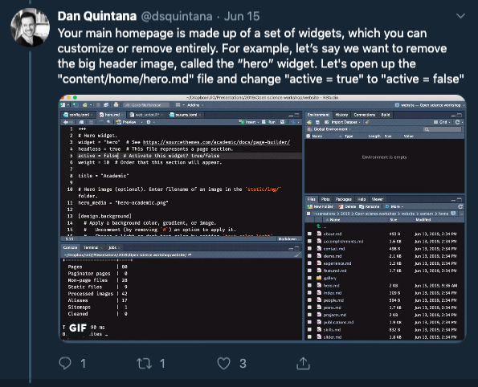
```


## Step `r advance()`: **Update your profile photo** *by saving your photo as 'avatar.jpg' in the "content/authors/admin" folder*

Overwrite the existing avatar.jpg file with your own photo. 

```{r, comment="", echo = F}
fs::dir_tree(path = "../academic_website/content/authors")
```

```{r, echo = F}
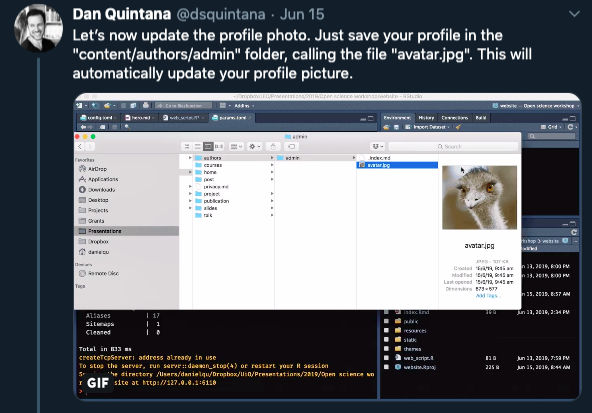
```

## Step `r advance()`: **Edit your biography details** *in the "content/authors/admin/\_index.md" file*  

```{r, comment="", echo = F}
fs::dir_tree(path = "../academic_website/content/authors")
```


```{r, echo = F}
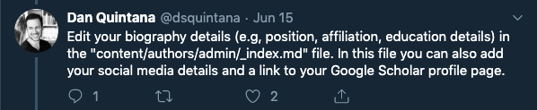
```

## Step `r advance()`: **Edit your contact details**  *in the "Contact Widget setup" section of config/\_default/params.toml"*

```{r, echo = F}
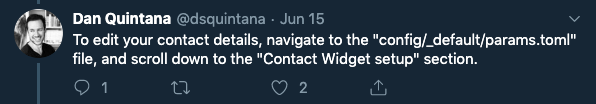
```

The section looks like this:

```r
############################
## Contact details
##
## These details power the Contact widget (if enabled).
## Additionally, for organizations, these details may be used to enrich search engine results.
############################

# Enter contact details (optional). To hide a field, clear it to "".
```


## Step `r advance()`: **Add your CV** *by copying your CV to "static/files/cv.pdf" and uncommenting*

```{r, echo = F}
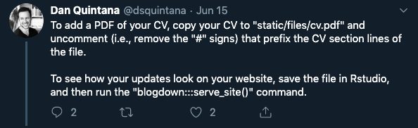
```

## Step `r advance()`: **Periodically view updates by serving site**  *using blogdown:::serve_site()* 

You may see them dynamically updating too. 

#### Note: **Maybe building the site first** *with rmarkdown::render_site(encoding = 'UTF-8')*

> To see how your updates look on your website, save the file in Rstudio, and then run the "blogdown:::serve_site()" command.

```{r, echo = F}
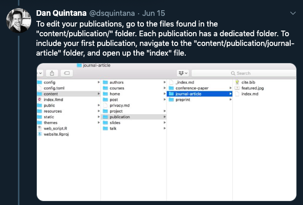
```

## Step `r advance()`: **Add your publications** *in the "content/publication/" folder*

> Each publication has a dedicated folder. To include your first publication, navigate to the "content/publication/journal-article" folder, and open up the "index" file.


### Step `r i`a: 


```{r, echo = F}

```

### Step `r i`b: **Edit your publication's details**


```{r, echo = F}
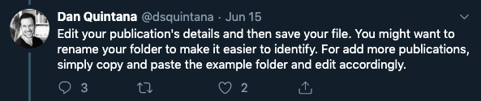
```

### Step `r i`c:  **Include image to be associated with your paper** 

> just add it to your publication's folder and call it "featured.jpg". This might be a figure from you paper.

```{r, echo = F}
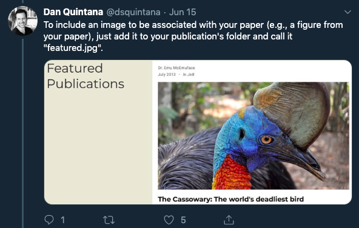
```

### Note: **Change tags for Papers, Talks, and Projects** *by editing the YAML*

Examples give you a lot of little links for projects and allow you to include a lot of information.  You may want to comment some of this out with `#`.  For example if you don't want the `deep learning` or `slides` tag:

```r
---
date: "2016-04-27T00:00:00Z"
external_link: ""
image:
  caption: Photo by rawpixel on Unsplash
  focal_point: Smart
links:
- icon: twitter
  icon_pack: fab
  name: Follow
  url: https://twitter.com/georgecushen
# slides: example
summary: An example of using the in-built project page.
# tags: 
# - Deep Learning 
title: Internal Project
url_code: ""
url_pdf: ""
url_slides: ""
url_video: ""
---


```


## Step `r advance()`: **Change what appears in header menu** *by editing config/_default/menus.toml* 


```{r, echo = F}
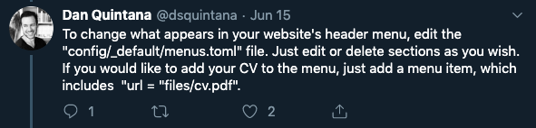
```

For example to delete "demo" comment it out with the `#` character.  Posts will show up, because it is not commented out:

```r

# Navigation Links
#   To link a homepage widget, specify the URL as a hash `#` followed by the filename of the
#     desired widget in your `content/home/` folder.
#   The weight parameter defines the order that the links will appear in.

#[[main]]
#  name = "Demo"
#  url = "#hero"
#  weight = 10

[[main]]
  name = "Posts"
  url = "#posts"
  weight = 80

```


## Step `r advance()`: **Deploy your website** *- one way is using Netlify*

```{r, echo = F}

```


### Step `r i`a.  **Create a free account with @Netlify**


### Step `r i`b.  **drag the "public" folder into the box at the bottom of the "deploys" section of your Netlify admin settings. **


```{r, echo = F}
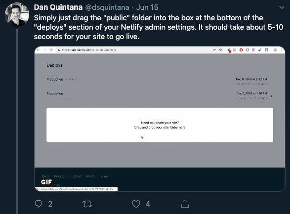
```

### Step `r i`c. **Edit your domain name**, which will include "netlify” at the end of your address. 


```{r, echo = F}
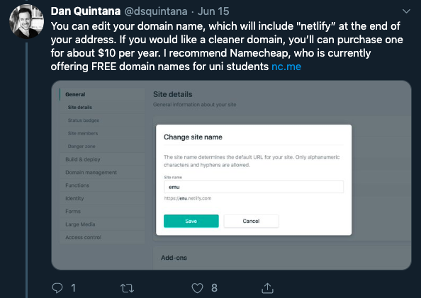

```

